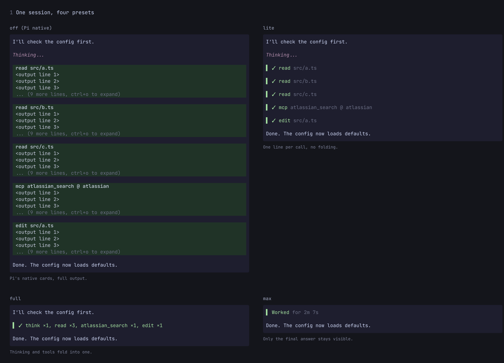

# pi-minimalist

[English](README.md) | [简体中文](README.zh-CN.md) | **Français**

> Traduction du [README.md](README.md) anglais ; en cas de divergence, la version anglaise fait foi. Les commandes, les noms de réglages et les clés JSON restent en anglais, pour que vous puissiez les retrouver dans l'interface.

**Moins de défilement. Plus de place pour la réponse.**

Un historique plus calme pour [Pi](https://pi.dev) : les appels d'outils volumineux deviennent des résumés d'une ligne, et vous ouvrez la sortie complète quand vous en avez besoin.

## Voir la différence

**Avant :** un seul appel d'outil occupe presque tout l'écran.


**Après :** le même appel, sur une ligne.


**Cliquez** sur une ligne repliée pour l'ouvrir en plusieurs lignes. Cliquez sur l'une d'elles pour n'afficher que sa sortie. Cliquez sur la ligne `▾ Expanded · click to fold` au-dessus d'une série ouverte pour la replier.


Appuyez sur **Ctrl+O** pour développer la sortie des outils, y compris les diffs et la coloration syntaxique. Les lignes développées renvoient aussi à la ligne les longues commandes au lieu de les couper. Rien n'est supprimé de la session ni caché au modèle : seul l'affichage change.

## Installation

```bash
pi install npm:pi-minimalist
```

Redémarrez Pi : les appels d'outils s'affichent en lignes compactes. Aucune configuration n'est nécessaire.

## Choisir le niveau de discrétion

Lancez **`/minimalist`** pour modifier les réglages en direct. Commencez par les lignes d'outils compactes, ou allez plus loin :

- **Combine consecutive tool calls** (regrouper les appels d'outils consécutifs) en un seul résumé, par exemple `read ×2, edit ×1`.
- **Collapse earlier activity** (replier l'activité précédente) pour garder la dernière réponse au premier plan. L'activité qui la précède est remplacée par le temps de travail ou le nombre d'outils.
- **Compact thinking rows** (lignes de réflexion compactes), ou garder la réflexion visible pendant qu'elle arrive.
- **Keep running tools visible** (garder visibles les outils en cours) pendant le regroupement des autres appels, avec un minuteur qui affiche leur durée.
- **Excluded tools** (outils exclus) : un outil donné (par exemple `subagent`) garde sa propre carte au lieu d'être réduit à une ligne. Ouvrez cette ligne dans `/minimalist`, tapez pour chercher, puis appuyez sur Entrée sur un outil pour le basculer.

Une nouvelle installation démarre avec le préréglage **`full`** (voir plus bas) : lignes d'outils compactes, appels regroupés et lignes de réflexion compactes. Le repli de l'activité est facultatif. Choisissez `lite` si vous préférez voir chaque appel séparément.

### Préréglages

La ligne **Preset** en haut de `/minimalist` règle quatre options à la fois : **Compact tool rows**, **Combine consecutive tool calls**, **Collapse earlier activity** et **Compact thinking rows**.

| Préréglage | Ce que vous obtenez |
| --- | --- |
| `off` | Les cartes d'outils natives de Pi. |
| `lite` | Des lignes d'outils d'une ligne, chaque appel sur sa propre ligne. |
| `full` | `lite`, plus les appels consécutifs regroupés et les lignes de réflexion compactes. |
| `max` | `full`, plus l'activité précédente repliée (`Worked for …`). |
| `custom` | Vos propres valeurs pour ces quatre options. |



Un préréglage n'écrase jamais vos réglages. Tant que `off`, `lite`, `full` ou `max` est sélectionné, seules ces quatre lignes sont grisées et affichent les valeurs du préréglage ; appuyer sur Entrée dessus ne fait rien. Toutes les autres options (Left border, Elapsed timer, Symbols, etc.) restent à vous et restent modifiables. Vos propres valeurs sont conservées et reviennent quand vous choisissez `custom`. La première fois que vous choisissez `custom`, il part de `lite`.

**Mise à jour :** si vos réglages contiennent déjà un bloc `minimalist`, vous restez sur `custom` et rien ne change. Seul un utilisateur sans aucun réglage `minimalist` démarre sur `full`, ce qui rend les lignes de réflexion compactes. Pour choisir un autre aspect, changez **Preset**.

### Commandes courantes

| Commande | Action |
| --- | --- |
| `/minimalist` | Ouvrir les réglages (`/minimalist config` fonctionne aussi) |
| `/minimalist status` | Afficher les réglages actuels |
| Ctrl+O | Développer ou replier la sortie des outils |
| Ctrl+T | Développer ou replier la réflexion |

Les réglages s'appliquent à l'historique existant et sont enregistrés globalement. Si un symbole s'affiche mal dans votre terminal, choisissez **Symbols → ASCII**. Aucune Nerd Font n'est requise.

## Revenir à l'affichage habituel de Pi

Désactivez **Compact tool rows** pour retrouver les cartes d'outils natives. Ou choisissez le préréglage `off`.

Pour désactiver complètement l'extension, lancez `pi config`, désactivez pi-minimalist, puis redémarrez Pi.

## Compatibilité

Testé avec Pi **1.0.0**. Les mises à jour de Pi peuvent affecter la compatibilité du rendu ; [signalez un problème](https://github.com/EviHex/pi-minimalist/issues) en indiquant votre version de Pi, votre terminal et une capture d'écran.

[Licence MIT](LICENSE).
