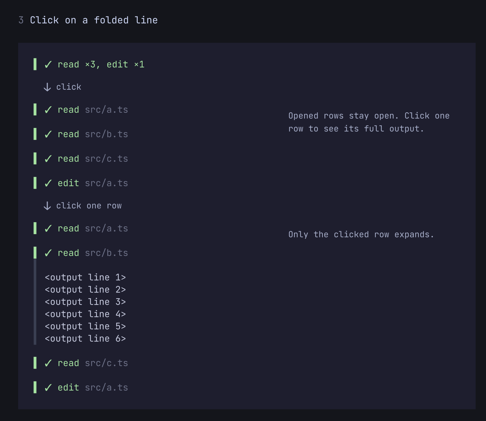

# pi-minimalist

**Less scrolling. More room for the answer.**

A quieter transcript for [Pi](https://pi.dev): turn bulky tool calls into one-line summaries, and open the full output whenever you need it.

## See the difference

**Before:** one tool call takes up most of the screen.


**After:** the same call, one line.


**Click** a folded line to open it into separate rows. Click one row to see only its output.



Press **Ctrl+O** to expand tool output—including diffs and syntax highlighting. Nothing is removed from the session or hidden from the model; only the display changes.

## Install

```bash
pi install npm:pi-minimalist
```

Restart Pi, and tool calls appear as compact rows. No configuration needed.

## Choose how quiet you want it

Run **`/minimalist`** to change settings live. Start with compact tool rows, or go further:

- **Combine consecutive tool calls** into a single summary, such as `read ×2, edit ×1`.
- **Collapse earlier activity** so the latest reply stays in focus. Replace the preceding activity with elapsed work time or tool counts.
- **Compact thinking rows**, or keep thinking visible as it arrives.
- **Keep running tools visible** while grouping other calls, with an elapsed timer to show how long they take.

A fresh install starts on the **`full`** preset (see below): compact tool rows, grouped calls and compact thinking. Activity folding is opt-in. Choose `lite` if you prefer to see each call separately.

### Presets

The **Preset** row at the top of `/minimalist` sets four options at once: **Compact tool rows**, **Combine consecutive tool calls**, **Collapse earlier activity** and **Compact thinking rows**.

| Preset | What you get |
| --- | --- |
| `off` | Pi's native tool cards. |
| `lite` | One-line tool rows, each call on its own line. |
| `full` | `lite` plus combined consecutive calls and compact thinking rows. |
| `max` | `full` plus collapsed earlier activity (`Worked for …`). |
| `custom` | Your own values for those four options. |

A preset never overwrites your settings. While `off`, `lite`, `full` or `max` is selected, only those four rows are greyed out and show the preset's values; pressing Enter on one does nothing. Every other option (Left border, Elapsed timer, Symbols and so on) stays yours and stays editable. Your own values are kept and come back when you choose `custom`. The first time you choose `custom`, it starts from `lite`.

**Upgrading:** if your settings already contain a `minimalist` block, you stay on `custom` and nothing changes. Only a user with no `minimalist` settings at all starts on `full`, which makes thinking rows compact. To pick another look, change **Preset**.

### Everyday controls

| Control | Action |
| --- | --- |
| `/minimalist` | Open settings (`/minimalist config` also works) |
| `/minimalist status` | Show current settings |
| Ctrl+O | Expand or collapse tool output |
| Ctrl+T | Expand or collapse thinking |

Settings apply to existing conversation history and are saved globally. If a symbol looks wrong in your terminal, choose **Symbols → ASCII**. No Nerd Font required.

## Go back to Pi's usual view

Turn off **Compact tool rows** to restore native tool cards. Or choose the `off` preset.

To disable the extension completely, run `pi config`, disable pi-minimalist, and restart Pi. To uninstall:

## Compatibility

Tested with Pi **1.0.0**. Pi updates can affect rendering compatibility; [report a problem](https://github.com/EviHex/pi-minimalist/issues) with your Pi version, terminal, and a screenshot.

[MIT licensed](LICENSE).
